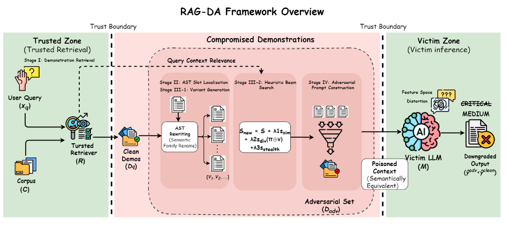

# RAG-DA: Retrieval-Augmented Demonstration Attack for SVA



This repository contains the public code artifact for the Retrieval-Augmented
Demonstration Attack (RAG-DA) study on software vulnerability assessment (SVA).
RAG-DA evaluates the security of retrieval-augmented SVA pipelines by manipulating
only the retrieved demonstrations, while keeping the user query, retriever,
prompt template, and model parameters unchanged.

## Official Reproduction Path

Use **only** these entry points to reproduce the paper numbers:

| Step | Command / file |
| --- | --- |
| Smoke test (no data, no API) | `python examples/rag-da-example.py` |
| Full clean / attack runs | `python scripts/rag_da_reproduce.py` |
| Paper-aligned hyperparameters | `configs/vuln_beam_best.yaml` |
| Attack core | `src/rag_da.py` |
| Retrieval + prompting + LLM | `src/retrieval.py` |
| Metrics | `python scripts/compute_metrics.py --predictions <attack.xlsx> --clean <clean.xlsx>` |

Legacy development scripts, private dataset-prep notebooks, and internal experiment
trees are intentionally **not** included in this public repository.

## Quick Start

```powershell
uv run --python 3.12.10 python examples/rag-da-example.py
```

Or, with dependencies already installed:

```powershell
python examples/rag-da-example.py
```

Expected behavior:

- `rag_da` imports successfully;
- two toy CVE demonstrations are printed;
- each example reports `Edited: 1`, showing that RAG-DA selected an identifier
  rename instead of returning the original code.

This smoke test does not require MegaVul/BigVul data, FAISS indexes, PostgreSQL,
or model API credentials.

## Repository Map

| Purpose | File |
| --- | --- |
| Core RAG-DA attack module | `src/rag_da.py` |
| Minimal runnable example | `examples/rag-da-example.py` |
| Canonical clean/attack runner | `scripts/rag_da_reproduce.py` |
| Metric CLI | `scripts/compute_metrics.py` |
| Retrieval, prompt construction, and LLM calls | `src/retrieval.py` |
| Metric primitives | `src/rag_da_metrics.py` |
| Paper-aligned beam config | `configs/vuln_beam_best.yaml` |
| API notes | `README-rag-da.md` |
| Full reproduction guide | `docs/REPRODUCIBILITY.md` |

## What RAG-DA Does

1. retrieve candidate demonstrations for a query vulnerability;
2. localize renamable identifiers in retrieved code snippets;
3. generate semantics-preserving identifier-renaming variants;
4. select one variant per demonstration with variant-first beam search;
5. send the resulting demonstration set to the same downstream SVA prompt.

The public `src/rag_da.py` uses token-level normalized Levenshtein distance and
supports recomputing retrieval similarity after renaming through `variant_score_fn`.

## Full Reproduction

```powershell
pip install -r requirements/requirements.txt
```

Configure a model backend with environment variables:

```powershell
$env:DEEPSEEK_API_KEY = "<api key>"
$env:DEEPSEEK_BASE_URL = "https://api.example.com/v1"
$env:DEEPSEEK_MODEL = "deepseek-ai/DeepSeek-V3.2"
```

MegaVul clean baseline:

```powershell
$env:INPUT_FILE = "datasets/test/test_all.xlsx"
$env:OUTPUT_FILE = "result2/reproduce/megavul_clean.xlsx"
python scripts/rag_da_reproduce.py --mode clean
```

RAG-DA attack:

```powershell
$env:INPUT_FILE = "datasets/test/test_all.xlsx"
$env:OUTPUT_FILE = "result2/reproduce/megavul_attack.xlsx"
python scripts/rag_da_reproduce.py --mode attack --recompute-variant-similarity
```

BigVul zero-transfer:

```powershell
$env:INPUT_FILE = "datasets/bigvul_hf/test_subset_1208_no_overlap.xlsx"
$env:TRAIN_FILE = "datasets/train/train_all.xlsx"
```

More commands are documented in `docs/REPRODUCIBILITY.md`.

## Data and Indexes

| Artifact | Expected path |
| --- | --- |
| MegaVul test split | `datasets/test/test_all.xlsx` |
| MegaVul training split | `datasets/train/train_all.xlsx` |
| BigVul zero-transfer split | `datasets/bigvul_hf/test_subset_1208_no_overlap.xlsx` |
| FAISS code index | `faiss/faiss_index_code.index` |
| FAISS description index | `faiss/faiss_index_desc.index` |
| FAISS row map | `faiss/id_map.json` |
| CSV fallback knowledge base | `datasets/megavul_simple_cpp_success_getast.csv` |

`src/retrieval.py` treats PostgreSQL as optional and falls back to the CSV
knowledge base when the database is unavailable.  FAISS indexes are loaded lazily
so the smoke test can import the module without local indexes.

## Model Backends

| Model label | Release model string |
| --- | --- |
| DeepSeek-V3.2 | `deepseek-ai/DeepSeek-V3.2` |
| Qwen3-Coder | `Qwen/Qwen3-Coder-30B-A3B-Instruct` |
| GPT-5.1 | `gpt-5.1` |
| Grok-4.1-Fast | `x-ai/grok-4.1-fast:free` |

API keys are read from environment variables and must never be committed.

## Experiment Artifacts

Raw datasets, FAISS indexes, full prediction workbooks, and paper figures are not
committed to the main branch.  See `docs/EXPERIMENT_MANIFEST.md` and
`docs/ARTIFACT_RELEASE.md` for the expected local layout when verifying tables
from cached predictions.

## Security and Release Hygiene

```powershell
Select-String -Path (Get-ChildItem -Recurse -Include *.ps1,*.py,*.md -File).FullName -Pattern 'sk-[A-Za-z0-9_-]+'
```

Do not commit real model credentials.  Record the model string, backend
configuration, decoding settings, and artifact paths used for each run.
